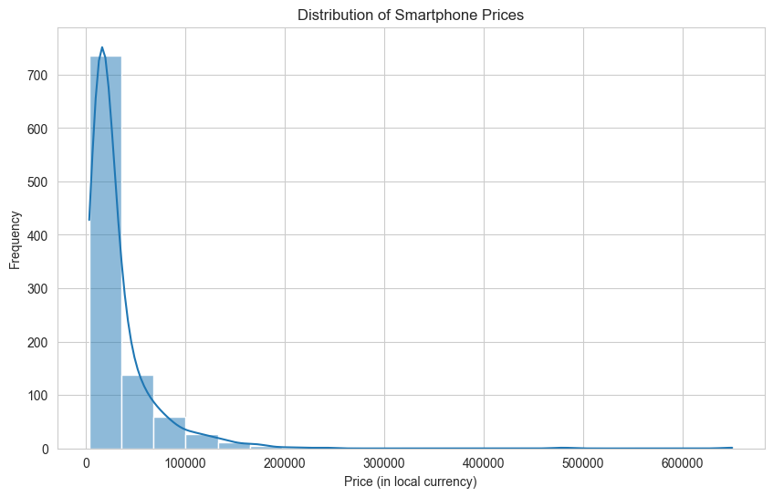
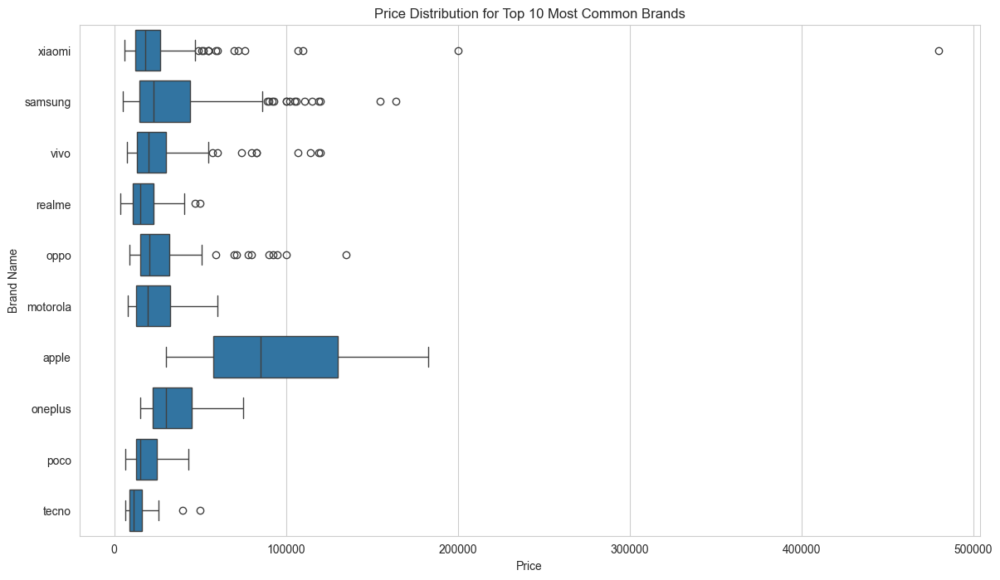
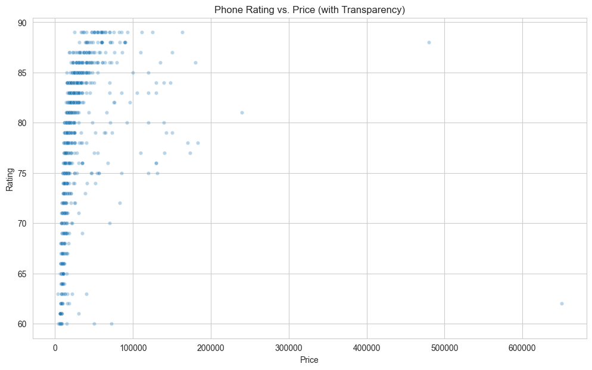
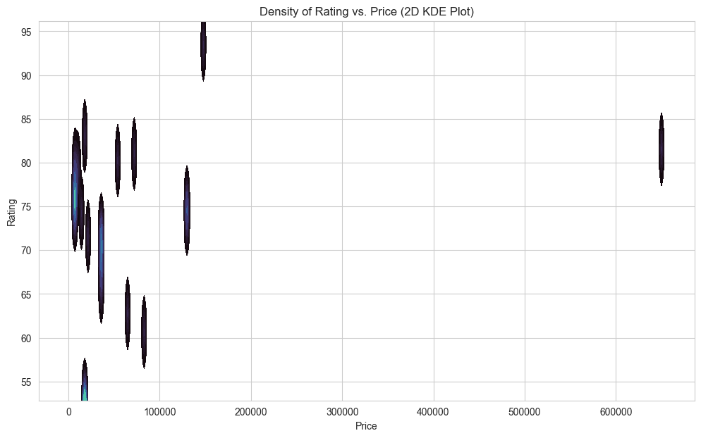
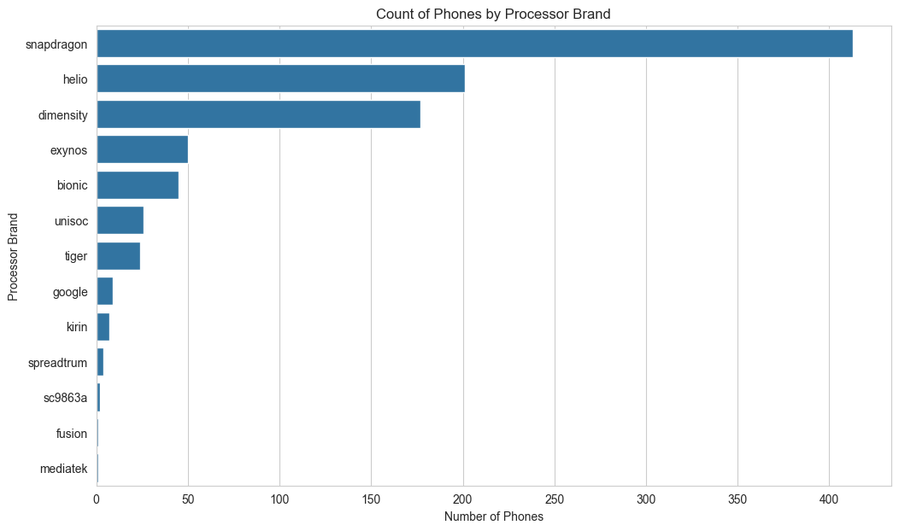
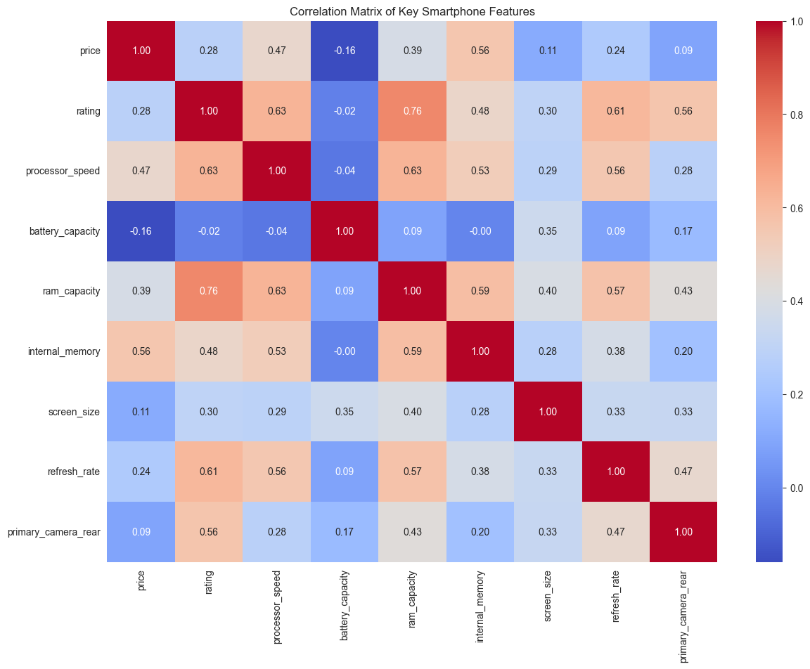

Smartphone Market Analysis Report[¶](#Smartphone-Market-Analysis-Report)
========================================================================

### 1\. Setup: Importing Essential Libraries[¶](#1.-Setup:-Importing-Essential-Libraries)

**Goal:** The first step in any data analysis project is to import the necessary libraries. These libraries are collections of pre-written code that provide the tools we need for data manipulation, numerical calculation, and visualization.

**Code Explanation:**

*   `import pandas as pd`: We import the **Pandas** library, which is the cornerstone of data analysis in Python. It provides the **DataFrame**, a powerful table-like structure for holding and working with our data. We give it the standard nickname `pd`.
*   `import numpy as np`: We import the **NumPy** library, the fundamental package for scientific and numerical computing. We'll use it here to represent the missing value in our sample data (`np.nan`).
*   `import matplotlib.pyplot as plt`: This is the primary plotting library in Python. It gives us fine-grained control over our visualizations.
*   `import seaborn as sns`: **Seaborn** is a visualization library built on top of Matplotlib. It provides a high-level interface for drawing attractive and informative statistical graphics, often with less code.
*   `sns.set_style('whitegrid')` & `plt.rcParams[...]`: These lines are for aesthetics. They set a clean visual style and a default size for all the plots we will create, ensuring they are consistent and easy to read.

**Outcome:** With this cell executed, our environment is now equipped with all the necessary tools for the entire analysis workflow.

In \[1\]:

\# Import necessary libraries
import pandas as pd
import numpy as np
import matplotlib.pyplot as plt
import seaborn as sns

\# Set plotting style for better aesthetics
sns.set\_style('whitegrid')
plt.rcParams\['figure.figsize'\] \= (12, 6)

print("Libraries imported successfully!")

Libraries imported successfully!

### 2\. Data Loading[¶](#2.-Data-Loading)

**Goal:** The next step is to load our dataset into the environment. For this analysis, we will load the data into a Pandas DataFrame, which is the best structure for handling and analyzing tabular data in Python.

**Code Explanation:**

*   `data = {...}`: In this notebook, we are defining the sample data directly using a Python **dictionary**. Each key in the dictionary (e.g., `'brand_name'`) becomes a column header, and the list of values associated with that key becomes the data for that column.
*   `df = pd.DataFrame(data)`: This is the most important line in this cell. We pass our `data` dictionary to the `pd.DataFrame()` constructor, which converts our raw data into a structured and highly versatile DataFrame object. We assign this object to the variable `df`, a standard convention.
*   `# df = pd.read_csv(...)`: This line is commented out but shows the typical method for loading data from an external file. In a real project, you would replace the dictionary with this line to load a larger dataset from a CSV file.
*   `df.head()`: After loading, we call the `.head()` method on our DataFrame. This displays the first five rows, allowing us to quickly verify that the data has been loaded correctly and to get a first glimpse of its structure.

**Outcome:** Our smartphone data is now successfully loaded into the `df` DataFrame, ready for the next stages of inspection and cleaning.

In \[5\]:

\# Create the DataFrame

df \= pd.read\_csv('Smartphones\_cleaned\_dataset.csv')

df.head()

Out\[5\]:

.dataframe tbody tr th:only-of-type { vertical-align: middle; } .dataframe tbody tr th { vertical-align: top; } .dataframe thead th { text-align: right; }

brand\_name

model

price

rating

has\_5g

has\_nfc

has\_ir\_blaster

processor\_brand

num\_cores

processor\_speed

...

refresh\_rate

num\_rear\_cameras

num\_front\_cameras

os

primary\_camera\_rear

primary\_camera\_front

extended\_memory\_available

extended\_upto

resolution\_width

resolution\_height

0

oneplus

OnePlus 11 5G

54999

89.0

True

True

False

snapdragon

8.0

3.2

...

120

3

1.0

android

50.0

16.0

0

NaN

1440

3216

1

oneplus

OnePlus Nord CE 2 Lite 5G

19989

81.0

True

False

False

snapdragon

8.0

2.2

...

120

3

1.0

android

64.0

16.0

1

1024.0

1080

2412

2

samsung

Samsung Galaxy A14 5G

16499

75.0

True

False

False

exynos

8.0

2.4

...

90

3

1.0

android

50.0

13.0

1

1024.0

1080

2408

3

motorola

Motorola Moto G62 5G

14999

81.0

True

False

False

snapdragon

8.0

2.2

...

120

3

1.0

android

50.0

16.0

1

1024.0

1080

2400

4

realme

Realme 10 Pro Plus

24999

82.0

True

False

False

dimensity

8.0

2.6

...

120

3

1.0

android

108.0

16.0

0

NaN

1080

2412

5 rows × 26 columns

### 3\. Initial Data Exploration[¶](#3.-Initial-Data-Exploration)

**Goal:** Before diving into analysis or visualization, we must first understand our data. This initial exploration acts as a "health check" to understand the dataset's structure, identify the data types of each column, check for obvious issues like missing data, and get a feel for the range and scale of our numerical features.

**Code Explanation:**

*   `df.info()`: This method provides a concise summary of the DataFrame. The output shows:
    *   The number of entries (rows).
    *   The number of columns.
    *   A list of all columns with their names, the count of non-null values, and their data type (`Dtype`). This is the best way to quickly spot columns with missing values.
*   `df.describe()`: This method generates descriptive statistics for all **numerical** columns. The output includes:
    *   `count`: The number of non-missing values.
    *   `mean`: The average value.
    *   `std`: The standard deviation, a measure of spread.
    *   `min` and `max`: The minimum and maximum values in the column.
    *   `25%`, `50%` (median), `75%`: The percentile values, which help us understand the data's distribution.

**Outcome:** From the `.info()` output, we can confirm the data types are mostly correct and identify columns with missing values (like `fast_charging` in our sample). The `.describe()` output gives us a quantitative sense of our data, for example, the price range and the average user rating. This knowledge directly informs our data cleaning strategy.

In \[6\]:

\# Get a concise summary of the dataframe
print("--- Data Info ---")
df.info()

print("\\n\--- Statistical Summary for Numerical Columns ---")
\# Get descriptive statistics for numerical columns
df.describe()

\--- Data Info ---
<class 'pandas.core.frame.DataFrame'>
RangeIndex: 980 entries, 0 to 979
Data columns (total 26 columns):
 #   Column                     Non-Null Count  Dtype  
---  ------                     --------------  -----  
 0   brand\_name                 980 non-null    object 
 1   model                      980 non-null    object 
 2   price                      980 non-null    int64  
 3   rating                     879 non-null    float64
 4   has\_5g                     980 non-null    bool   
 5   has\_nfc                    980 non-null    bool   
 6   has\_ir\_blaster             980 non-null    bool   
 7   processor\_brand            960 non-null    object 
 8   num\_cores                  974 non-null    float64
 9   processor\_speed            938 non-null    float64
 10  battery\_capacity           969 non-null    float64
 11  fast\_charging\_available    980 non-null    int64  
 12  fast\_charging              769 non-null    float64
 13  ram\_capacity               980 non-null    int64  
 14  internal\_memory            980 non-null    int64  
 15  screen\_size                980 non-null    float64
 16  refresh\_rate               980 non-null    int64  
 17  num\_rear\_cameras           980 non-null    int64  
 18  num\_front\_cameras          976 non-null    float64
 19  os                         966 non-null    object 
 20  primary\_camera\_rear        980 non-null    float64
 21  primary\_camera\_front       975 non-null    float64
 22  extended\_memory\_available  980 non-null    int64  
 23  extended\_upto              500 non-null    float64
 24  resolution\_width           980 non-null    int64  
 25  resolution\_height          980 non-null    int64  
dtypes: bool(3), float64(10), int64(9), object(4)
memory usage: 179.1+ KB

--- Statistical Summary for Numerical Columns ---

Out\[6\]:

.dataframe tbody tr th:only-of-type { vertical-align: middle; } .dataframe tbody tr th { vertical-align: top; } .dataframe thead th { text-align: right; }

price

rating

num\_cores

processor\_speed

battery\_capacity

fast\_charging\_available

fast\_charging

ram\_capacity

internal\_memory

screen\_size

refresh\_rate

num\_rear\_cameras

num\_front\_cameras

primary\_camera\_rear

primary\_camera\_front

extended\_memory\_available

extended\_upto

resolution\_width

resolution\_height

count

980.000000

879.000000

974.000000

938.000000

969.000000

980.000000

769.000000

980.000000

980.000000

980.000000

980.000000

980.000000

976.000000

980.000000

975.000000

980.000000

500.000000

980.000000

980.000000

mean

32520.504082

78.258248

7.772074

2.427217

4817.748194

0.854082

46.126138

6.560204

141.036735

6.536765

92.256122

2.814286

1.029713

50.319286

16.589128

0.630612

736.064000

1075.852041

2214.663265

std

39531.812669

7.402854

0.836845

0.464090

1009.540054

0.353205

34.277870

2.744378

107.134516

0.349162

28.988052

0.776441

0.169882

33.000968

10.876802

0.482885

366.894911

290.164931

516.484254

min

3499.000000

60.000000

4.000000

1.200000

1821.000000

0.000000

10.000000

1.000000

8.000000

3.540000

60.000000

1.000000

1.000000

2.000000

0.300000

0.000000

32.000000

480.000000

480.000000

25%

12999.000000

74.000000

8.000000

2.050000

4500.000000

1.000000

18.000000

4.000000

64.000000

6.500000

60.000000

2.000000

1.000000

24.000000

8.000000

0.000000

512.000000

1080.000000

1612.000000

50%

19994.500000

80.000000

8.000000

2.300000

5000.000000

1.000000

33.000000

6.000000

128.000000

6.580000

90.000000

3.000000

1.000000

50.000000

16.000000

1.000000

1024.000000

1080.000000

2400.000000

75%

35491.500000

84.000000

8.000000

2.840000

5000.000000

1.000000

66.000000

8.000000

128.000000

6.670000

120.000000

3.000000

1.000000

64.000000

16.000000

1.000000

1024.000000

1080.000000

2408.000000

max

650000.000000

89.000000

8.000000

3.220000

22000.000000

1.000000

240.000000

18.000000

1024.000000

8.030000

240.000000

4.000000

2.000000

200.000000

60.000000

1.000000

2048.000000

2460.000000

3840.000000

### 1\. Analysis of Smartphone Price Distribution[¶](#1.-Analysis-of-Smartphone-Price-Distribution)

**Question:** What is the typical price range for smartphones in this dataset, and how are the prices distributed? Are they clustered at the low end, high end, or evenly spread out?

**Approach:** A histogram is the ideal visualization for understanding the distribution of a single continuous variable like price. It groups prices into bins and shows the frequency of phones in each bin. We also add a Kernel Density Estimate (KDE) curve to show a smoothed version of the distribution shape.

**Code Explanation:**

*   `sns.histplot(df['price'], kde=True, bins=30)`: This is the main function call.
    *   `df['price']`: We select the 'price' column from our DataFrame to plot.
    *   `kde=True`: This overlays the smoothed density curve on top of the histogram bars.
    *   `bins=30`: We specify 30 bins to get a reasonably detailed view of the distribution. More bins provide more detail but can be noisy; fewer bins give a smoother but less detailed view.
*   `plt.title(...)`, `plt.xlabel(...)`, `plt.ylabel(...)`: These lines add a descriptive title and labels to the axes, which is crucial for making the plot understandable.

**Insight:** From this chart, we can quickly identify the price points where most smartphones are concentrated. We can see if the market is skewed towards budget-friendly phones (a peak on the left), luxury phones (a peak on the right), or if there's a strong mid-range presence. Any gaps or multiple peaks could also indicate distinct market segments.

In \[17\]:

plt.figure(figsize\=(10, 6))
sns.histplot(df\['price'\], kde\=True, bins\=20)
plt.title('Distribution of Smartphone Prices')
plt.xlabel('Price (in local currency)')
plt.ylabel('Frequency')
plt.show()

### 2\. Comparing Prices Across Top Brands[¶](#2.-Comparing-Prices-Across-Top-Brands)

**Question:** How do smartphone prices vary from one brand to another? Which brands are positioned as premium, and which are focused on the budget market?

**Approach:** A box plot is perfect for comparing the distributions of a numerical variable (price) across different categories (brands). However, plotting every single brand could make the chart unreadable. To solve this, we first identify the top 10 most frequently occurring brands in our dataset and then create a box plot just for them. A horizontal orientation is used to make the brand names easy to read.

**Code Explanation:**

1.  **Data Preparation:**
    *   `top_10_brands = df['brand_name'].value_counts().nlargest(10).index`: This line first counts how many phones each brand has (`value_counts()`), then selects the top 10 (`nlargest(10)`), and finally gets their names (`.index`).
    *   `df_top_brands = df[df['brand_name'].isin(top_10_brands)]`: We filter the original DataFrame to create a new one, `df_top_brands`, that only contains rows corresponding to these top 10 brands.
2.  **Plotting:**
    *   `sns.boxplot(x='price', y='brand_name', data=df_top_brands, order=top_10_brands)`:
        *   `x='price', y='brand_name'`: By putting the numerical value on the x-axis and the category on the y-axis, we create a horizontal plot.
        *   `data=df_top_brands`: We tell Seaborn to use our filtered DataFrame.
        *   `order=top_10_brands`: This ensures the brands are plotted in order of their frequency, making the chart cleaner.

**Insight:** Each "box" represents the middle 50% of prices for that brand, with the line inside the box marking the median price. The "whiskers" show the range of typical prices, and individual dots represent potential outliers. This allows us to compare both the average price point (median) and the price consistency (size of the box) for each major brand.

In \[18\]:

\# Find the top 10 most common brands in the dataset
top\_10\_brands \= df\['brand\_name'\].value\_counts().nlargest(10).index

\# Filter the DataFrame to include only these top brands
df\_top\_brands \= df\[df\['brand\_name'\].isin(top\_10\_brands)\]

\# Create the box plot
plt.figure(figsize\=(14, 8))
sns.boxplot(x\='price', y\='brand\_name', data\=df\_top\_brands, order\=top\_10\_brands)
plt.title('Price Distribution for Top 10 Most Common Brands')
plt.xlabel('Price')
plt.ylabel('Brand Name')
plt.show()

### 3\. Investigating the Relationship Between Price and Rating[¶](#3.-Investigating-the-Relationship-Between-Price-and-Rating)

**Question:** Is there a relationship between a smartphone's price and its rating? Do more expensive phones generally receive higher ratings?

**Approach:** A standard scatter plot is used to visualize the relationship between two numerical variables. However, with thousands of data points, this can result in "overplotting," where the points overlap into an unreadable blob. To combat this, we explore three effective visualization techniques.

* * *

#### Method A: Scatter Plot with Transparency[¶](#Method-A:-Scatter-Plot-with-Transparency)

**Approach:** The simplest fix is to make each point semi-transparent using the `alpha` parameter. Where many points overlap, the color becomes darker, naturally revealing areas of high data concentration. We also plot a random sample of the data if the dataset is extremely large to improve performance.

**Code Explanation:**

*   `data=df.sample(...) if len(df) > 2000 else df`: This is a conditional statement that plots a random sample of 2000 points if the DataFrame is large, otherwise it uses the whole DataFrame.
*   `alpha=0.3`: This is the key parameter. It sets the transparency of each point to 30%, making it possible to see the density of points.
*   `s=20`: This reduces the size of each marker, further helping to reduce overplotting.

**Insight:** This improved scatter plot allows us to see the general trend. If we see the cloud of points moving from the bottom-left to the top-right, it suggests a positive correlation—as price increases, rating tends to increase as well. The dense areas show the most common price-rating combinations.

* * *

#### Method B: Hexbin Plot for Density[¶](#Method-B:-Hexbin-Plot-for-Density)

**Approach:** A hexbin plot is specifically designed to handle overplotting. It divides the plotting area into many hexagons and colors each hexagon based on the number of data points it contains. It's essentially a 2D histogram.

**Code Explanation:**

*   `sns.jointplot(...)`: This function is powerful because it shows not only the relationship between the two variables but also their individual distributions on the top and right margins.
*   `kind='hex'`: This crucial argument tells `jointplot` to create a hexbin plot instead of a scatter plot.
*   `cmap='viridis'`: This specifies a color map where darker colors represent lower counts and brighter colors (like yellow) represent higher counts.

**Insight:** The brightest hexagons immediately draw our attention to the areas with the highest concentration of smartphones. This clearly shows the most common price-rating segments in the market, something a standard scatter plot would completely hide.

* * *

#### Method C: 2D Density Plot (KDE)[¶](#Method-C:-2D-Density-Plot-(KDE))

**Approach:** This method creates a smooth "contour map" of the data. It's a two-dimensional version of the KDE curve we saw on the histogram, showing where data points are most concentrated.

**Code Explanation:**

*   `sns.kdeplot(..., fill=True)`: This function calculates and plots the 2D kernel density estimate. The `fill=True` argument shades the areas between the contour lines, making the density easier to visualize.
*   `cmap='mako'`: We select a sequential color map which is visually appealing for this type of plot.
*   `thresh=0.05`: This parameter tells the plot to not draw contours in areas with very low density, cleaning up the visualization.

**Insight:** The innermost, darkest rings represent the "peaks" of our data landscape—the regions where the density of phones is highest. This gives a polished, smooth representation of the relationship's hotspots, free from the noise of individual points.

In \[19\]:

plt.figure(figsize\=(12, 7))
sns.scatterplot(
    data\=df.sample(n\=2000, random\_state\=1) if len(df) \> 2000 else df, \# Use a sample if data is huge
    x\='price', 
    y\='rating', 
    alpha\=0.3, \# Set transparency (0.0 to 1.0)
    s\=20       \# Reduce marker size
)
plt.title('Phone Rating vs. Price (with Transparency)')
plt.xlabel('Price')
plt.ylabel('Rating')
plt.show()

In \[20\]:

\# A jointplot shows both the relationship and the individual distributions
sns.jointplot(data\=df, x\='price', y\='rating', kind\='hex', height\=8, cmap\='viridis')
plt.suptitle('Density of Rating vs. Price (Hexbin Plot)', y\=1.02)
plt.show()

In \[21\]:

plt.figure(figsize\=(12, 7))
sns.kdeplot(data\=df, x\='price', y\='rating', fill\=True, cmap\='mako', thresh\=0.05)
plt.title('Density of Rating vs. Price (2D KDE Plot)')
plt.xlabel('Price')
plt.ylabel('Rating')
plt.show()

### 4\. Analyzing Processor Brand Market Share[¶](#4.-Analyzing-Processor-Brand-Market-Share)

**Question:** What are the most common processor brands in the smartphones from our dataset?

**Approach:** To count the occurrences of different categories (the processor brands), a bar plot is the most effective visualization. We create a horizontal bar plot because it provides ample space for the brand names on the y-axis, ensuring they are readable even if they are long.

**Code Explanation:**

1.  **Data Preparation:**
    *   `processor_counts = df['processor_brand'].value_counts()`: We first use `value_counts()` to create a Series containing each unique processor brand and the number of times it appears.
2.  **Plotting:**
    *   `sns.barplot(x=processor_counts.values, y=processor_counts.index, orient='h')`:
        *   We pass the counts (`.values`) to the x-axis and the brand names (`.index`) to the y-axis.
        *   `orient='h'` explicitly specifies a horizontal orientation.

**Insight:** This graph provides an immediate, clear view of the market share for processor brands within our dataset. We can easily identify the dominant players and compare their prevalence relative to each other.

In \[22\]:

plt.figure(figsize\=(12, 7))
\# Using barplot on value\_counts() gives more control
processor\_counts \= df\['processor\_brand'\].value\_counts()
sns.barplot(x\=processor\_counts.values, y\=processor\_counts.index, orient\='h')
plt.title('Count of Phones by Processor Brand')
plt.xlabel('Number of Phones')
plt.ylabel('Processor Brand')
plt.show()

### 5\. Exploring Correlations Between Key Features[¶](#5.-Exploring-Correlations-Between-Key-Features)

**Question:** How are various numerical features of a smartphone related to each other? For instance, does higher RAM capacity strongly correlate with a higher price? Does battery capacity relate to screen size?

**Approach:** A heatmap is the best tool for visualizing the correlation matrix of multiple variables. It uses color to represent the strength of the correlation between every pair of features, allowing us to spot important relationships at a glance.

**Code Explanation:**

1.  **Data Preparation:**
    *   `corr_features = ['price', 'rating', ...]`: We first define a list of the numerical columns we are interested in analyzing.
    *   `corr_matrix = df[corr_features].corr()`: We select only these columns from the DataFrame and then use the `.corr()` method to compute the pairwise correlation matrix. The result is a table where each cell (i, j) contains the correlation coefficient between column i and column j.
2.  **Plotting:**
    *   `sns.heatmap(corr_matrix, ...)`: This function takes the correlation matrix and visualizes it.
    *   `annot=True`: This is a crucial argument that annotates (writes) the numerical correlation value in each cell of the heatmap.
    *   `cmap='coolwarm'`: We use a "diverging" colormap. It uses a neutral color for values near zero (no correlation), and two distinct colors for positive (warm, e.g., red) and negative (cool, e.g., blue) correlations.
    *   `fmt='.2f'`: This formats the annotation numbers to show only two decimal places.

**Insight:** We can interpret the heatmap by looking at the color and value in each square.

*   **Values near +1.0 (e.g., bright red)** indicate a strong positive correlation (as one feature increases, the other tends to increase).
*   **Values near -1.0 (e.g., bright blue)** indicate a strong negative correlation (as one feature increases, the other tends to decrease).
*   **Values near 0 (neutral color)** indicate little to no linear correlation. This helps us quickly identify the most influential features related to price or rating.

In \[23\]:

\# Select key numerical features for the correlation matrix
corr\_features \= \['price', 'rating', 'processor\_speed', 'battery\_capacity', 'ram\_capacity', 
                 'internal\_memory', 'screen\_size', 'refresh\_rate', 'primary\_camera\_rear'\]

\# Calculate the correlation matrix
corr\_matrix \= df\[corr\_features\].corr()

\# Plot the heatmap
plt.figure(figsize\=(14, 10))
sns.heatmap(corr\_matrix, annot\=True, cmap\='coolwarm', fmt\='.2f')
plt.title('Correlation Matrix of Key Smartphone Features')
plt.show()

