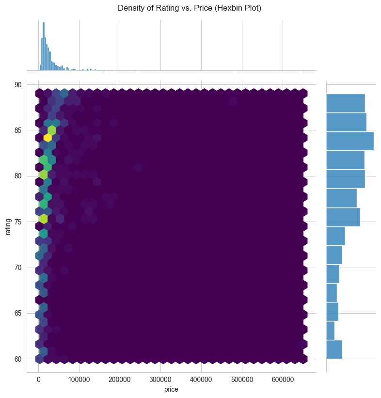

## Smartphone Market Analysis Report
### 1. Setup: Importing Essential Libraries

**Goal:** The first step in any data analysis project is to import the necessary libraries. These libraries are collections of pre-written code that provide the tools we need for data manipulation, numerical calculation, and visualization.

```python
# Import necessary libraries
import pandas as pd
import numpy as np
import matplotlib.pyplot as plt
import seaborn as sns

# Set plotting style for better aesthetics
sns.set_style('whitegrid')
plt.rcParams['figure.figsize'] = (12, 6)

print("Libraries imported successfully!")
```

**Code Explanation:**
* `import pandas as pd`: We import the **Pandas** library, which is the cornerstone of data analysis in Python. It provides the `DataFrame`, a powerful table-like structure for holding and working with our data. We give it the standard nickname `pd`.
* `import numpy as np`: We import the **NumPy** library, the fundamental package for scientific and numerical computing. We'll use it here to represent the missing value in our sample data (`np.nan`).
* `import matplotlib.pyplot as plt`: This is the primary plotting library in Python. It gives us fine-grained control over our visualizations.
* `import seaborn as sns`: **Seaborn** is a visualization library built on top of Matplotlib. It provides a high-level interface for drawing attractive and informative statistical graphics, often with less code.
* `sns.set_style('whitegrid')` & `plt.rcParams[...]`: These lines are for aesthetics. They set a clean visual style and a default size for all the plots we will create, ensuring they are consistent and easy to read.

**Outcome:** With this cell executed, our environment is now equipped with all the necessary tools for the entire analysis workflow.

### 2. Data Loading

**Goal:** The next step is to load our dataset into the environment. For this analysis, we will load the data into a Pandas DataFrame, which is the best structure for handling and analyzing tabular data in Python.

```python
# Create the DataFrame
df = pd.read_csv('Smartphones_cleaned_dataset.csv')
df.head()
```

**Code Explanation:**
* `df = pd.read_csv(...)`: This is the typical method for loading data from an external file (like a `.csv`). It reads the data and converts it into a structured and highly versatile DataFrame object, which we assign to the variable `df`.
* `df.head()`: After loading, we call the `.head()` method on our DataFrame. This displays the first five rows, allowing us to quickly verify that the data has been loaded correctly and to get a first glimpse of its structure.

**Outcome:** Our smartphone data is now successfully loaded into the `df` DataFrame, ready for the next stages of inspection and cleaning.
|    | brand_name | model                       |   price |   rating | has_5g | processor_brand   |   ram_capacity |   ... |
|---:|:-----------|:----------------------------|--------:|---------:|:-------|:------------------|---------------:|:------|
|  0 | oneplus    | OnePlus 11 5G               |   54999 |     89 | True   | snapdragon        |              8 | ...   |
|  1 | oneplus    | OnePlus Nord CE 2 Lite 5G   |   19989 |     81 | True   | snapdragon        |              6 | ...   |
|  2 | samsung    | Samsung Galaxy A14 5G       |   16499 |     75 | True   | exynos            |              4 | ...   |
|  3 | motorola   | Motorola Moto G62 5G        |   14999 |     81 | True   | snapdragon        |              6 | ...   |
|  4 | realme     | Realme 10 Pro Plus          |   24999 |     82 | True   | dimensity         |              6 | ...   |

*Showing 5 of 980 total rows and a sample of 26 total columns.*

### 3. Initial Data Exploration

**Goal:** Before diving into analysis or visualization, we must first understand our data. This initial exploration acts as a "health check" to understand the dataset's structure, identify the data types of each column, check for obvious issues like missing data, and get a feel for the range and scale of our numerical features.

```python
# Get a concise summary of the dataframe
print("--- Data Info ---")
df.info()

print("\n--- Statistical Summary for Numerical Columns ---")
# Get descriptive statistics for numerical columns
df.describe()
```

**Code Explanation:**
* `df.info()`: This method provides a concise summary of the DataFrame. The output shows the number of rows and columns, and a list of all columns with their names, the count of non-null values, and their data type (`Dtype`). This is the best way to quickly spot columns with missing values.
* `df.describe()`: This method generates descriptive statistics for all **numerical** columns. The output includes count, mean, standard deviation, min/max values, and percentiles, which help us understand the data's distribution.

**Outcome:** From the `.info()` output, we can confirm the data types are mostly correct and identify columns with missing values. The `.describe()` output gives us a quantitative sense of our data, for example, the price range and the average user rating. This knowledge directly informs our data cleaning strategy.
| Column Name                 | Data Type (Dtype) |
| :-------------------------- | :---------------- |
| brand_name                  | object            |
| model                       | object            |
| price                       | int64             |
| rating                      | float64           |
| has_5g                      | bool              |
| has_nfc                     | bool              |
| has_ir_blaster              | bool              |
| processor_brand             | object            |
| num_cores                   | float64           |
| processor_speed             | float64           |
| battery_capacity            | float64           |
| fast_charging_available     | int64             |
| fast_charging               | float64           |
| ram_capacity                | int64             |
| internal_memory             | int64             |
| screen_size                 | float64           |
| refresh_rate                | int64             |
| num_rear_cameras            | int64             |
| num_front_cameras           | float64           |
| os                          | object            |
| primary_camera_rear         | float64           |
| primary_camera_front        | float64           |
| extended_memory_available   | int64             |
| extended_upto               | float64           |
| resolution_width            | int64             |
| resolution_height           | int64             |
|        |       price |    rating |   battery_capacity |   ram_capacity |   internal_memory |   screen_size |   primary_camera_rear | ...   |
|:-------|------------:|----------:|-------------------:|---------------:|------------------:|--------------:|----------------------:|:------|
| count  |    980      |   879     |         969        |      980       |        980        |      980      |           980         | ...   |
| mean   |  32520.5    |    78.26  |        4817.75     |        6.56    |        141.04     |        6.54   |            50.32      | ...   |
| std    |  39531.8    |     7.4   |        1009.54     |        2.74    |        107.13     |        0.35   |            33         | ...   |
| min    |   3499      |    60     |        1821        |        1       |          8        |        3.54   |             2         | ...   |
| 25%    |  12999      |    74     |        4500        |        4       |         64        |        6.5    |            24         | ...   |
| 50%    |  19994.5    |    80     |        5000        |        6       |        128        |        6.58   |            50         | ...   |
| 75%    |  35491.5    |    84     |        5000        |        8       |        128        |        6.67   |            64         | ...   |
| max    | 650000      |    89     |       22000        |       18       |       1024        |        8.03   |           200         | ...   |

*Descriptive statistics for a sample of the numerical columns.*

### 4. Analysis of Smartphone Price Distribution

**Question:** What is the typical price range for smartphones in this dataset, and how are the prices distributed? Are they clustered at the low end, high end, or evenly spread out?

**Approach:** A histogram is the ideal visualization for understanding the distribution of a single continuous variable like price. It groups prices into bins and shows the frequency of phones in each bin. We also add a Kernel Density Estimate (KDE) curve to show a smoothed version of the distribution shape.

```python
plt.figure(figsize=(10, 6))
sns.histplot(df['price'], kde=True, bins=20)
plt.title('Distribution of Smartphone Prices')
plt.xlabel('Price (in local currency)')
plt.ylabel('Frequency')
plt.show()
```

**Code Explanation:**
* `sns.histplot(df['price'], kde=True, bins=30)`: This is the main function call.
    * `df['price']`: We select the 'price' column from our DataFrame to plot.
    * `kde=True`: This overlays the smoothed density curve on top of the histogram bars.
    * `bins=30`: We specify 30 bins to get a reasonably detailed view of the distribution.
* `plt.title(...)`, `plt.xlabel(...)`, `plt.ylabel(...)`: These lines add a descriptive title and labels to the axes, which is crucial for making the plot understandable.

**Insight:** From this chart, we can quickly identify the price points where most smartphones are concentrated. We can see if the market is skewed towards budget-friendly phones (a peak on the left), luxury phones (a peak on the right), or if there's a strong mid-range presence.


### 5. Comparing Prices Across Top Brands

**Question:** How do smartphone prices vary from one brand to another? Which brands are positioned as premium, and which are focused on the budget market?

**Approach:** A box plot is perfect for comparing the distributions of a numerical variable (price) across different categories (brands). To avoid a cluttered chart, we first identify the top 10 most frequently occurring brands and then create a box plot just for them.

```python
# Find the top 10 most common brands in the dataset
top_10_brands = df['brand_name'].value_counts().nlargest(10).index

# Filter the DataFrame to include only these top brands
df_top_brands = df[df['brand_name'].isin(top_10_brands)]

# Create the box plot
plt.figure(figsize=(14, 8))
sns.boxplot(x='price', y='brand_name', data=df_top_brands, order=top_10_brands)
plt.title('Price Distribution for Top 10 Most Common Brands')
plt.xlabel('Price')
plt.ylabel('Brand Name')
plt.show()
```

**Code Explanation:**
1.  **Data Preparation:**
    * `top_10_brands = df['brand_name'].value_counts().nlargest(10).index`: This line first counts how many phones each brand has (`value_counts()`), then selects the top 10 (`nlargest(10)`), and finally gets their names (`.index`).
    * `df_top_brands = df[df['brand_name'].isin(top_10_brands)]`: We filter the original DataFrame to create a new one that only contains rows for these top 10 brands.
2.  **Plotting:**
    * `sns.boxplot(x='price', y='brand_name', ...)`: By putting the numerical value on the x-axis and the category on the y-axis, we create a horizontal plot that makes brand names easy to read.
    * `order=top_10_brands`: This ensures the brands are plotted in order of their frequency.

**Insight:** Each "box" represents the middle 50% of prices for that brand, with the line inside marking the median price. The "whiskers" show the range of typical prices, and individual dots represent potential outliers. This allows us to compare both the average price point and the price consistency for each major brand.


### 6. Investigating the Relationship Between Price and Rating

**Question:** Is there a relationship between a smartphone's price and its rating? Do more expensive phones generally receive higher ratings?

**Approach:** A standard scatter plot can suffer from "overplotting" with many data points. To combat this, we explore three effective visualization techniques: a scatter plot with transparency, a hexbin plot, and a 2D density plot.

---

#### Method A: Scatter Plot with Transparency
**Approach:** The simplest fix for overplotting is to make each point semi-transparent using the `alpha` parameter. Where many points overlap, the color becomes darker, naturally revealing areas of high data concentration.

```python
plt.figure(figsize=(12, 7))
sns.scatterplot(
    data=df.sample(n=2000, random_state=1) if len(df) > 2000 else df, # Use a sample if data is huge
    x='price', 
    y='rating', 
    alpha=0.3, # Set transparency (0.0 to 1.0)
    s=20       # Reduce marker size
)
plt.title('Phone Rating vs. Price (with Transparency)')
plt.xlabel('Price')
plt.ylabel('Rating')
plt.show()
```

**Code Explanation:**
* `alpha=0.3`: This is the key parameter. It sets the transparency of each point to 30%, making it possible to see the density of points.
* `s=20`: This reduces the size of each marker, further helping to reduce overplotting.

**Insight:** This improved scatter plot allows us to see the general trend. A cloud of points moving from the bottom-left to the top-right suggests a positive correlation—as price increases, rating tends to increase as well.


---

#### Method B: Hexbin Plot for Density
**Approach:** A hexbin plot is specifically designed to handle overplotting. It divides the plotting area into many hexagons and colors each one based on how many data points it contains. It's essentially a 2D histogram.

```python
# A jointplot shows both the relationship and the individual distributions
sns.jointplot(data=df, x='price', y='rating', kind='hex', height=8, cmap='viridis')
plt.suptitle('Density of Rating vs. Price (Hexbin Plot)', y=1.02)
plt.show()
```

**Code Explanation:**
* `sns.jointplot(...)`: This function is powerful because it shows not only the relationship between the two variables but also their individual distributions on the top and right margins.
* `kind='hex'`: This crucial argument tells `jointplot` to create a hexbin plot instead of a scatter plot.

**Insight:** The brightest hexagons immediately draw our attention to the areas with the highest concentration of smartphones. This clearly shows the most common price-rating segments in the market.



---

#### Method C: 2D Density Plot (KDE)
**Approach:** This method creates a smooth "contour map" of the data. It's a two-dimensional version of the KDE curve we saw on the histogram, showing where data points are most concentrated.

```python
plt.figure(figsize=(12, 7))
sns.kdeplot(data=df, x='price', y='rating', fill=True, cmap='mako', thresh=0.05)
plt.title('Density of Rating vs. Price (2D KDE Plot)')
plt.xlabel('Price')
plt.ylabel('Rating')
plt.show()
```

**Code Explanation:**
* `sns.kdeplot(..., fill=True)`: This function calculates and plots the 2D kernel density estimate. The `fill=True` argument shades the areas between the contour lines, making the density easier to visualize.
* `thresh=0.05`: This parameter tells the plot to not draw contours in areas with very low density, cleaning up the visualization.

**Insight:** The innermost, darkest rings represent the "peaks" of our data landscape—the regions where the density of phones is highest, giving a polished representation of the relationship's hotspots.


### 7. Analyzing Processor Brand Market Share

**Question:** What are the most common processor brands in the smartphones from our dataset?

**Approach:** To count the occurrences of different categories, a bar plot is the most effective visualization. We use a horizontal orientation to ensure the brand names are readable.

```python
plt.figure(figsize=(12, 7))
# Using barplot on value_counts() gives more control
processor_counts = df['processor_brand'].value_counts()
sns.barplot(x=processor_counts.values, y=processor_counts.index, orient='h')
plt.title('Count of Phones by Processor Brand')
plt.xlabel('Number of Phones')
plt.ylabel('Processor Brand')
plt.show()
```

**Code Explanation:**
1.  **Data Preparation:**
    * `processor_counts = df['processor_brand'].value_counts()`: We use `value_counts()` to create a Series containing each unique processor brand and the number of times it appears.
2.  **Plotting:**
    * `sns.barplot(x=processor_counts.values, y=processor_counts.index, orient='h')`: We pass the counts (`.values`) to the x-axis and the brand names (`.index`) to the y-axis with a horizontal orientation.

**Insight:** This graph provides an immediate, clear view of the market share for processor brands within our dataset. We can easily identify the dominant players and compare their prevalence.


### 8. Exploring Correlations Between Key Features

**Question:** How are various numerical features of a smartphone related to each other? For instance, does higher RAM capacity strongly correlate with a higher price?

**Approach:** A heatmap is the best tool for visualizing the correlation matrix of multiple variables. It uses color to represent the strength of the correlation between every pair of features, allowing us to spot important relationships at a glance.

```python
# Select key numerical features for the correlation matrix
corr_features = ['price', 'rating', 'processor_speed', 'battery_capacity', 'ram_capacity', 
                 'internal_memory', 'screen_size', 'refresh_rate', 'primary_camera_rear']

# Calculate the correlation matrix
corr_matrix = df[corr_features].corr()

# Plot the heatmap
plt.figure(figsize=(14, 10))
sns.heatmap(corr_matrix, annot=True, cmap='coolwarm', fmt='.2f')
plt.title('Correlation Matrix of Key Smartphone Features')
plt.show()
```

**Code Explanation:**
1.  **Data Preparation:**
    * `corr_features = [...]`: We first define a list of the numerical columns we are interested in analyzing.
    * `corr_matrix = df[corr_features].corr()`: We select only these columns and use the `.corr()` method to compute the pairwise correlation matrix.
2.  **Plotting:**
    * `sns.heatmap(corr_matrix, ...)`: This function takes the correlation matrix and visualizes it.
    * `annot=True`: This annotates the numerical correlation value in each cell.
    * `cmap='coolwarm'`: We use a "diverging" colormap where red indicates a positive correlation, blue indicates a negative correlation, and the neutral color indicates no correlation.
    * `fmt='.2f'`: This formats the annotation numbers to show two decimal places.

**Insight:** Values near **+1.0 (bright red)** indicate a strong positive correlation. Values near **-1.0 (bright blue)** indicate a strong negative correlation. Values near **0 (neutral color)** indicate little to no linear correlation. This helps us quickly identify the most influential features related to price or rating.


